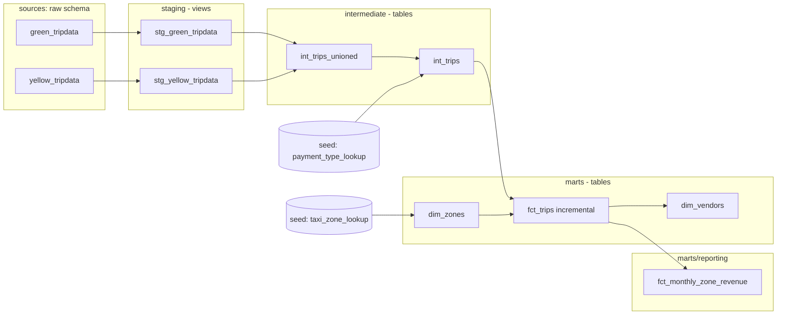

# Module 4: Analytics Engineering (dbt)

NY Taxi trip data (green + yellow, January 2019) transformed into a tested, documented star schema with [dbt](https://www.getdbt.com/), running locally on [DuckDB](https://duckdb.org/).

## What is dbt?

dbt (data build tool) is the "T" in ELT: it lets you write transformations as version-controlled SQL `select` statements and turns them into tables/views in the warehouse, handling dependency ordering, testing, and documentation for you. Instead of hand-writing `CREATE TABLE ... AS SELECT` statements and tracking execution order yourself, you write a **model** (a `.sql` file containing a `select`), reference other models/sources with Jinja (`{{ ref('other_model') }}`, `{{ source('raw', 'table') }}`), and dbt:

- **Compiles** those references into a DAG (directed acyclic graph), so downstream models automatically run after everything they depend on.
- **Materializes** each model however it's configured — `view`, `table`, `incremental`, or `ephemeral` — cheap for iteration, efficient for production, per-model.
- **Tests** data with declarative assertions (`not_null`, `unique`, `accepted_values`, `relationships`, custom SQL) defined right next to the models they check.
- **Documents** the project from `schema.yml` descriptions, generating a browsable lineage graph and column-level docs site for free.
- Is **database-agnostic**: the same project can target Postgres, BigQuery, Snowflake, DuckDB, etc., with vendor differences abstracted behind macros — a model's SQL doesn't need to know which warehouse it's running on.

This module builds a small but realistic dbt project end to end: raw sources → staging → intermediate → marts, with generic + singular tests, a contract on the fact table, seeds, custom macros, and a package dependency.

## Why DuckDB here

Modules 2–3 loaded the same NY taxi data into BigQuery. This module runs the same kind of transformation pipeline entirely locally against a DuckDB file (`taxi_rides_ny.duckdb`) instead — no cloud project or credentials required to follow along. The project isn't tied to DuckDB, though: `sources.yml`, the `safe_cast` macro, and the reporting mart all branch on `target.type`, so pointing `profiles.yml` at the BigQuery dataset from module 2/3 would work without touching model SQL (see [BigQuery portability](#bigquery-portability) below).

## Project layout

```
taxi_rides_ny/
├── dbt_project.yml          # project config: materializations per folder, dev sampling window
├── packages.yml             # package dependencies (dbt_utils, codegen)
├── ingest.py                # loads raw NYC TLC parquet into the local DuckDB `prod` schema
├── seeds/
│   ├── taxi_zone_lookup.csv     # TLC taxi zone → borough/zone/service_zone
│   └── payment_type_lookup.csv  # payment_type code → description
├── macros/
│   ├── safe_cast.sql               # cast() everywhere, safe_cast() on BigQuery
│   ├── get_trip_duration_minutes.sql  # cross-database datediff wrapper
│   └── get_vendor_data.sql         # vendor_id → vendor_name CASE statement
├── models/
│   ├── staging/             # 1:1 with raw sources, renamed/typed columns, views
│   │   ├── sources.yml
│   │   ├── stg_green_tripdata.sql
│   │   └── stg_yellow_tripdata.sql
│   ├── intermediate/        # union + clean + dedupe, tables
│   │   ├── int_trips_unioned.sql
│   │   └── int_trips.sql
│   └── marts/                # business-facing star schema, tables
│       ├── dim_zones.sql
│       ├── dim_vendors.sql
│       ├── fct_trips.sql        # incremental
│       └── reporting/
│           └── fct_monthly_zone_revenue.sql
├── snapshots/                # empty (not used in this module)
└── tests/                    # empty (only generic + package tests used, no singular tests)
```

## Data lineage



## Models

| Layer | Model | Materialization | What it does |
|---|---|---|---|
| staging | `stg_green_tripdata` | view | Renames/casts raw `green_tripdata` columns (`lpep_*` → `pickup_datetime`/`dropoff_datetime`, etc.), drops rows with a null `vendor_id`. |
| staging | `stg_yellow_tripdata` | view | Same for `yellow_tripdata` (`tpep_*` timestamps). |
| intermediate | `int_trips_unioned` | table | `UNION ALL` of both staging models onto one normalized schema, tagging each row with `service_type` ('Green'/'Yellow') and backfilling columns one side is missing (`ehail_fee`, `trip_type`). |
| intermediate | `int_trips` | table | Deduplicates (`qualify row_number()` per vendor/pickup time/location/service), builds a surrogate `trip_id` via `dbt_utils.generate_surrogate_key`, and enriches with a human-readable `payment_type_description` from the `payment_type_lookup` seed. |
| marts | `dim_zones` | table | Pass-through of the `taxi_zone_lookup` seed (renamed to `location_id`/`borough`/`zone`/`service_zone`) — kept as a model rather than referencing the seed directly, so it can be enriched later. |
| marts | `dim_vendors` | table | Distinct `vendor_id` values from `fct_trips`, mapped to `vendor_name` via the `get_vendor_data` macro. |
| marts | `fct_trips` | **incremental** (`merge` on `trip_id`, `on_schema_change='append_new_columns'`) | The central fact table: `int_trips` joined twice to `dim_zones` (pickup + dropoff), with `trip_duration_minutes` computed via `get_trip_duration_minutes`. On incremental runs, only processes rows newer than `max(pickup_datetime)` already in the table. Has an **enforced contract** (declared `data_type` per column). |
| marts/reporting | `fct_monthly_zone_revenue` | table | Aggregates `fct_trips` by `pickup_zone` × `revenue_month` × `service_type`: revenue breakdown (fare/extra/tax/tip/tolls/surcharge/total), trip count, average passengers/distance. |

## Seeds

CSVs dbt loads directly into the warehouse as tables (`dbt seed`), used as small reference/lookup data rather than raw source data:

- **`taxi_zone_lookup.csv`** — NYC TLC taxi zones (based on the city's Neighborhood Tabulation Areas), used to enrich pickup/dropoff `location_id` with borough, zone, and service zone in `dim_zones`.
- **`payment_type_lookup.csv`** — payment type code → description, used in `int_trips` to add `payment_type_description`.

## Macros

- **`safe_cast(column, data_type)`** — emits `safe_cast(...)` on BigQuery (returns `NULL` on cast failure instead of erroring) and plain `cast(...)` everywhere else. Used in staging for fields more prone to bad raw values (`ratecodeid`, `trip_type`, `payment_type`).
- **`get_trip_duration_minutes(pickup_datetime, dropoff_datetime)`** — thin wrapper around dbt's built-in cross-database `dbt.datediff(...)` macro, used in `fct_trips`.
- **`get_vendor_data(vendor_id_column)`** — builds a `CASE` expression at compile time from a Jinja dict (`{1: 'Creative Mobile Technologies', 2: 'VeriFone Inc.', 4: 'Unknown/Other'}`), used in `dim_vendors`.

## Packages

Declared in `packages.yml`, installed with `dbt deps`:

- **[`dbt-labs/dbt_utils`](https://github.com/dbt-labs/dbt-utils)** — used for `generate_surrogate_key` (the `trip_id` hash in `int_trips`) and the `unique_combination_of_columns` test on `fct_monthly_zone_revenue`.
- **[`dbt-labs/codegen`](https://github.com/dbt-labs/dbt-codegen)** — dev-time helper for generating `source`/`model` YAML boilerplate (not used at run time).

## Testing & data quality

- **Generic (schema) tests** throughout the `schema.yml` files: `not_null`, `unique`, `accepted_values` (e.g. `service_type` must be `Green`/`Yellow`), and `relationships` (e.g. `fct_trips.pickup_location_id` must exist in `dim_zones.location_id`).
- **`dbt_utils.unique_combination_of_columns`** on `fct_monthly_zone_revenue` — guards against duplicate rows per zone/month/service-type in the aggregate.
- **Contract enforcement** (`config.contract.enforced: true`) on `fct_trips` — every column's declared `data_type` in `schema.yml` is checked against what the model actually produces at build time, catching type drift early on a model other things depend on.
- Run everything with `dbt test`, or `dbt build` to interleave models and their tests in dependency order (fails fast instead of building the whole DAG on top of bad data).

## Dev vs. prod: sampling pattern

Raw parquet is loaded **once** into the DuckDB file's `prod` schema by `ingest.py`. From there:

- The `dev` target (see `profiles.yml` below) writes models into a separate `dev` schema. The staging models filter to `vars.dev_start_date`–`vars.dev_end_date` (`dbt_project.yml`, currently `2019-01-01`–`2019-02-01`) whenever `target.name == 'dev'`, so local development/iteration runs fast on a small slice without re-loading or duplicating data.
- The `prod` target writes into the `prod` schema and processes the full loaded dataset (no date filter).

This mirrors a common real-world pattern: one raw dataset, a sampled dev environment for fast iteration, and an unsampled prod environment for the real build — without needing two copies of the raw data.

## BigQuery portability

Even though this module runs on DuckDB, several places are already written to also work on BigQuery:

- `models/staging/sources.yml` — `database`/`schema` for the `raw` source branch between a `GCP_PROJECT_ID` env var + `nytaxi` dataset (BigQuery) and `taxi_rides_ny` + `prod` (anything else).
- `macros/safe_cast.sql` — uses `safe_cast` only on BigQuery.
- `models/marts/reporting/fct_monthly_zone_revenue.sql` — branches its month-truncation expression between `date_trunc(pickup_datetime, month)` (BigQuery) and `date_trunc('month', pickup_datetime)` (DuckDB).

To point this project at the BigQuery dataset created in [module 2](../02-workflow-orchestration)/[module 3](../03-data-warehouse) instead, you'd add a `bigquery` output to `profiles.yml` and set `GCP_PROJECT_ID` — no model code changes needed. Not wired up or tested in this local run.

## Setup

### 1. Create a virtual environment and install dbt

This was set up with [uv](https://docs.astral.sh/uv/); plain `pip` works the same way.

```bash
cd 04-analytics-engineering
uv venv
source .venv/bin/activate
uv pip install dbt-duckdb
```

### 2. Configure your dbt profile

dbt reads connection info from `~/.dbt/profiles.yml`, which is **not** checked into the repo (it can contain credentials). For this project:

```yaml
taxi_rides_ny:
  target: dev
  outputs:
    dev:
      type: duckdb
      path: taxi_rides_ny.duckdb
      schema: dev
      threads: 1
      extensions:
        - parquet
      settings:
        memory_limit: '4GB'
        preserve_insertion_order: false

    prod:
      type: duckdb
      path: taxi_rides_ny.duckdb
      schema: prod
      threads: 1
      extensions:
        - parquet
      settings:
        memory_limit: '4GB'
        preserve_insertion_order: false
```

### 3. Load the raw data

Downloads the official NYC TLC green/yellow parquet files for January 2019 into the local DuckDB `prod` schema:

```bash
cd taxi_rides_ny
python ingest.py
```

### 4. Install dbt packages

```bash
dbt deps
```

### 5. Load seeds

```bash
dbt seed
```

### 6. Build the project

```bash
dbt build       # seeds already loaded, so this runs models + tests in dependency order
```

or step by step:

```bash
dbt run
dbt test
```

Both default to the `dev` target (small, date-filtered dataset). To build against the full dataset:

```bash
dbt build --target prod
```

### 7. Browse the docs / lineage graph

```bash
dbt docs generate
dbt docs serve
```

## Notes

- `taxi_rides_ny.duckdb`, `dbt_packages/`, seed-adjacent data files, and `profiles.yml` are gitignored (see `taxi_rides_ny/.gitignore`) — only project source (models, macros, seeds CSVs, config) is checked in.
- `dbt_project.yml` points `target-path`/`log-path`/`packages-install-path` outside this repo, at `~/.dbt-local-cache/taxi_rides_ny/`. This repo lives under iCloud Drive (`Documents/`), and dbt rewriting many small files quickly under an actively-syncing folder was causing iCloud to create `"name 2"` conflict copies — moving the generated/ephemeral dirs out of `Documents/` avoids that. This is a local, environment-specific workaround, not something the project needs in general.
